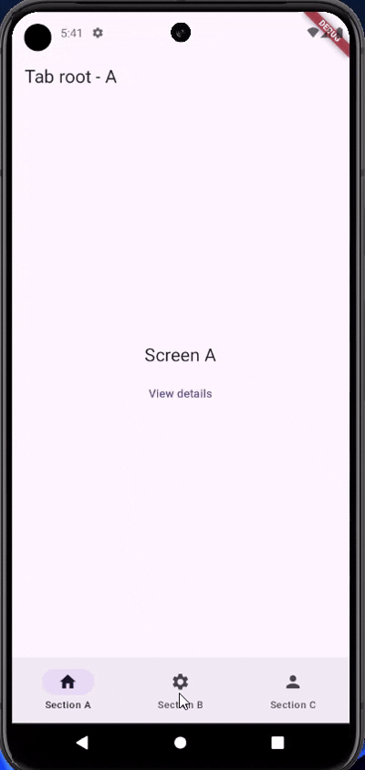
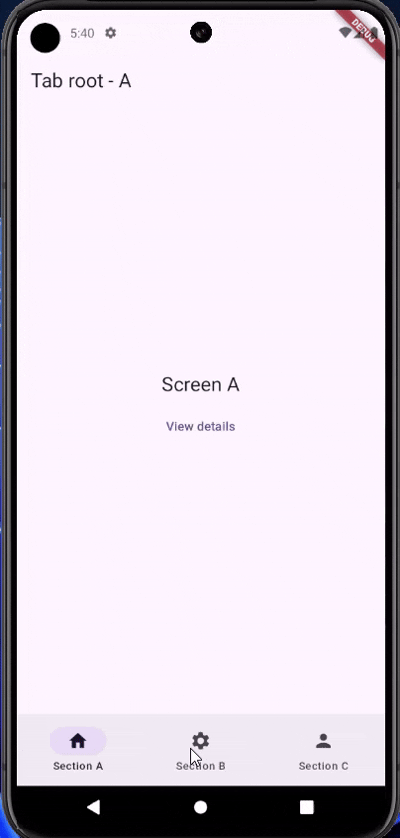
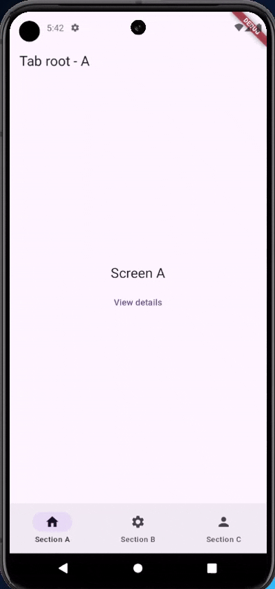

# Shell Route Transitions

A Flutter package that provides beautiful and customizable transitions for shell routes in Flutter applications. This package makes it easy to add professional-looking animations when navigating between routes.


## Features

- **Multiple Animation Types**: Choose from several pre-built animations:
  - Fade transitions
  - Horizontal slide transitions
  - Vertical slide transitions
  - Scale transitions
- **Customizable**: Create your own custom transitions
- **Easy Integration**: Simple to use with Go Router or other navigation solutions
- **Performant**: Optimized for smooth animations

## Transition Types

### Fade Transition


### Horizontal Slide Transition


### Vertical Slide Transition


### Scale Transition



## Getting Started

Add the package to your `pubspec.yaml` file:

```yaml
dependencies:
  shell_route_transitions: ^0.0.2
```

Then run:

```bash
flutter pub get
```

## Usage

### Basic Usage

```dart
import 'package:shell_route_transitions/shell_route_transitions.dart';

CustomRouteTransitionBuilder transitionBuilder = ShellRouteTransitions.fade;

GoRouter(
  routes: [
    ShellRoute(
      builder: (context, state, child) {
        return ShellScaffold(
          transitionBuilder: (context, index, child) {
            return ShellRouteTransitions.fade(
              index: index,
              child: child,
              currentIndex: _currentIndex,
              nextIndex: _nextIndex,
              animation: animation,
            );
          },
          child: child,
        );
      },
     
    ),
  ],
)
```

### Available Transitions

```dart
// Fade transition
ShellRouteTransitions.fade

// Horizontal slide transition
ShellRouteTransitions.slideHorizontal

// Vertical slide transition
ShellRouteTransitions.slideVertical

// Scale transition
ShellRouteTransitions.scale
```

### Real-World Example with AnimatedStatefulShellRoute

Here's a complete example showing how to use shell route transitions with GoRouter and a bottom navigation bar:

```dart
import 'package:flutter/material.dart';
import 'package:go_router/go_router.dart';
import 'package:shell_route_transitions/animated_stateful_shell_route.dart';
import 'package:shell_route_transitions/route_transition.dart';

void main() {
  WidgetsFlutterBinding.ensureInitialized();
  runApp(const MyApp());
}

class MyApp extends StatelessWidget {
  const MyApp({super.key});

  @override
  Widget build(BuildContext context) {
    return MaterialApp.router(
      title: 'Shell Route Transitions Example',
      theme: ThemeData(
        colorScheme: ColorScheme.fromSeed(seedColor: Colors.deepPurple),
        useMaterial3: true,
      ),
      routerConfig: goRouter,
    );
  }
}

// Navigation setup with shell route transitions
final goRouter = GoRouter(
  initialLocation: '/a',
  debugLogDiagnostics: true,
  routes: [
    AnimatedStatefulShellRoute(
      transitionDuration: const Duration(milliseconds: 300),
      transitionBuilder: ShellRouteTransitions.scale, // Choose your transition type
      builder: (context, state, navigationShell) {
        return ScaffoldWithNestedNavigation(navigationShell: navigationShell);
      },
      branches: [
        StatefulShellBranch(
          routes: [
            GoRoute(
              path: '/a',
              builder: (context, state) =>
                  const RootScreen(label: 'A', detailsPath: '/a/details'),
            ),
          ],
        ),
        StatefulShellBranch(
          routes: [
            GoRoute(
              path: '/b',
              builder: (context, state) =>
                  const RootScreen(label: 'B', detailsPath: '/b/details'),
            ),
          ],
        ),
        StatefulShellBranch(
          routes: [
            GoRoute(
              path: '/c',
              builder: (context, state) =>
                  const RootScreen(label: 'C', detailsPath: '/c/details'),
            ),
          ],
        ),
      ],
    ),
  ],
);

// Basic navigation shell with responsive layout
class ScaffoldWithNestedNavigation extends StatelessWidget {
  const ScaffoldWithNestedNavigation({Key? key, required this.navigationShell})
    : super(key: key ?? const ValueKey<String>('ScaffoldWithNestedNavigation'));
  final StatefulNavigationShell navigationShell;

  void _goBranch(int index) {
    navigationShell.goBranch(
      index,
      initialLocation: index == navigationShell.currentIndex,
    );
  }

  @override
  Widget build(BuildContext context) {
    return LayoutBuilder(
      builder: (context, constraints) {
        if (constraints.maxWidth < 450) {
          return ScaffoldWithNavigationBar(
            body: navigationShell,
            selectedIndex: navigationShell.currentIndex,
            onDestinationSelected: _goBranch,
          );
        } else {
          return ScaffoldWithNavigationRail(
            body: navigationShell,
            selectedIndex: navigationShell.currentIndex,
            onDestinationSelected: _goBranch,
          );
        }
      },
    );
  }
}

## Creating Custom Transitions

You can create your own custom transitions by implementing the `CustomRouteTransitionBuilder` function type:

```dart
// Define your custom transition
CustomRouteTransitionBuilder myCustomTransition = ({
  required int index,
  required Widget child,
  required int currentIndex,
  required int nextIndex,
  required Animation<double> animation,
}) {
  // Example: A custom rotation transition
  double rotationZ = 0.0;
  double opacity = 0.0;
  
  if (index == currentIndex && index != nextIndex) {
    rotationZ = animation.value * 0.5; // Rotate up to 0.5 radians
    opacity = 1.0 - animation.value;
  } else if (index == nextIndex) {
    rotationZ = (1.0 - animation.value) * -0.5; // Start rotated and go to 0
    opacity = animation.value;
  } else if (index == currentIndex && index == nextIndex) {
    rotationZ = 0.0;
    opacity = 1.0;
  }
  
  return Positioned.fill(
    child: Transform(
      transform: Matrix4.rotationZ(rotationZ),
      alignment: Alignment.center,
      child: Opacity(opacity: opacity, child: child),
    ),
  );
};

// Or use the helper method
CustomRouteTransitionBuilder customRotationTransition = ShellRouteTransitions.createCustomTransition(
  ({
    required int index,
    required Widget child,
    required int currentIndex,
    required int nextIndex,
    required Animation<double> animation,
  }) {
    double rotationZ = 0.0;
    double opacity = 0.0;
    
    if (index == currentIndex && index != nextIndex) {
      rotationZ = animation.value * 0.5;
      opacity = 1.0 - animation.value;
    } else if (index == nextIndex) {
      rotationZ = (1.0 - animation.value) * -0.5;
      opacity = animation.value;
    } else if (index == currentIndex && index == nextIndex) {
      rotationZ = 0.0;
      opacity = 1.0;
    }
    
    return Positioned.fill(
      child: Transform(
        transform: Matrix4.rotationZ(rotationZ),
        alignment: Alignment.center,
        child: Opacity(opacity: opacity, child: child),
      ),
    );
  },
);

// Use it in your GoRouter
AnimatedStatefulShellRoute(
  transitionBuilder: customRotationTransition,
  // Other properties...
)
```

## Additional Information

- [GitHub Repository](https://github.com/BawarX/shelll_route_animation)
- [Bug Reports and Feature Requests](https://github.com/BawarX/shelll_route_animation/issues)
- [API Documentation](https://pub.dev/documentation/shell_route_transitions/latest/)
